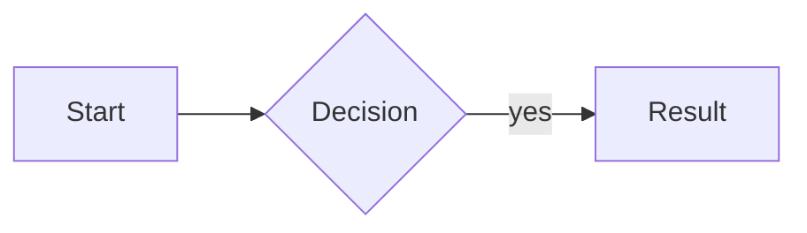
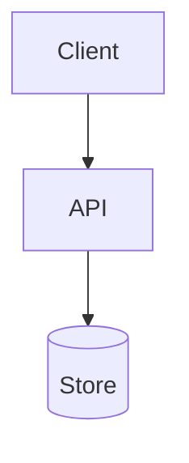

# protodoc templates

Skeletons and markup contracts for the two docs and the export. Adapt the
section lists to the subject — they are a starting shape, not a schema.

- [Mockups](#mockups)
- [User doc](#user-doc)
- [Tech doc](#tech-doc)
- [DECISIONS.md](#decisionsmd)
- [BUILD.md](#buildmd)

## Mockups

Every user-facing surface gets a drawn screen. Screens are raw HTML blocks in
the markdown, wrapped in the one class the review site styles:

```html
<div class="screen" data-label="New climb">
  <p><strong>Fjord Arête</strong> · Lofoten</p>
  <ul>
    <li>Grade: 6a+</li>
    <li>Style: onsight</li>
  </ul>
  <p><button>Log it</button></p>
</div>
```

`data-label` becomes the screen's title bar. The site supplies the frame, the
sans-serif face and the spacing, so write plain semantic HTML inside and leave
the chrome alone. Inline `style` only where the layout *is* the point — a
sidebar width, a two-column split, a colour that carries meaning.

Blank lines inside the block are fine; it is consumed as one unit up to the
matching closing tag.

Mockups are `negotiable` unless the user pins them. Draw the flow honestly:
loading, empty and error states are where designs turn out to be wrong, so a
screen set that only shows the happy path has not been reviewed yet.

## User doc

The manual you would ship, written as though the product exists. Present tense,
second person, no roadmap language. `01-index.md` first, then one page per flow.

```markdown
# <Product>

One paragraph a stranger can read to know what this is and who it's for.

## What it's for

The situation before this exists, and what changes.

## What it isn't

Two or three things people will assume it does. Cutting them here is cheaper
than cutting them in code.
```

Each flow page:

```markdown
# <Doing the thing>

Why someone reaches for this, in a sentence.

## The flow



## <Each screen>

What the person sees, then the screen, then what each control does.

## Rules

Statements that could turn out false. Tag the load-bearing ones.

- Logging never blocks on network. `pinned`
- Grade defaults to the route's. `negotiable`
```

## Tech doc

Every claim traces to a promise in the user doc. Name the alternatives you
rejected — a decision without a discarded option was not a decision.

```markdown
# Architecture

## Shape



## Pieces

| Piece | Does | Talks to | Rigidity |
|---|---|---|---|
| Client | draws screens, queues writes | API | pinned |
| Store | one row per climb | API | negotiable |

## Rejected

| Option | Why not |
|---|---|
| Sync-on-write | breaks the offline promise in `user-doc/01-logging.md` |
```

Then one page each for the data model (entities, fields, what's derived), the
interfaces (operations, inputs, failure modes), and anything the user doc
promises that is genuinely hard to deliver.

## DECISIONS.md

Redistilled every round from resolved annotations. The *why* is the payload —
it stops an implementing agent from re-litigating what you already settled.

```markdown
# Decisions

| # | Decision | Rigidity | Why |
|---|---|---|---|
| 1 | Grade is editable per climb | pinned | soft grades are the common case (#1, pushed back) |
| 2 | Seasons are date ranges, not tags | negotiable | tags needed a manager screen nobody asked for |
```

Cite the annotation id when a decision came out of one. Log reopened decisions
as new rows rather than editing the old one.

## BUILD.md

Written at export. It frames the docs; it does not restate them.

```markdown
# Build <product>

## Read first

1. `user-doc/` — what it does, for whom
2. `tech-doc/` — how it's built
3. `DECISIONS.md` — why, and what was already rejected
4. `mockups/` — the screens, as standalone HTML

## This is theory

Nothing here has been built or run. It was designed on paper and reviewed, but
no line of it has met a compiler, a real dataset or a real user.

Deviate when reality disagrees — a library that doesn't work the way this
assumes, a shape that collapses under real data, a screen that can't be built
as drawn. When you do, say so and say why. What you may not do is quietly drop
a `pinned` decision: those are the product. If one looks impossible, stop and
report rather than working around it.

## Rigidity

| Decision | State | Note |
|---|---|---|
| Offline-first writes | pinned | the product is a crag tool; a network dependency kills it |
| Postgres | negotiable | wanted a relational store, not this one specifically |
| Existing auth | constrained | already in the codebase, do not replace |

## Open questions

Unresolved on purpose. Answer them as you build and record what you chose.

1. …

## Done means

Observable statements, not tasks. "A climb logged in airplane mode appears on
another device within a minute of reconnecting."
```
